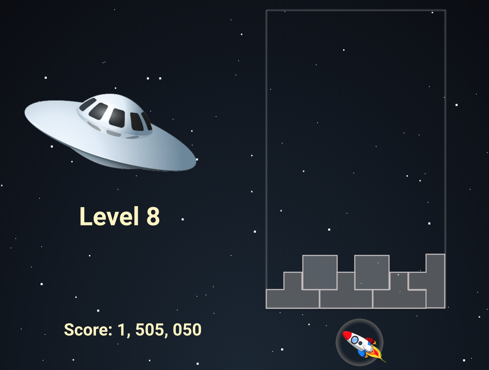

# Block Attack

## Technologies
- Vanilla javascript for game logic and rendering

## Background and Overview

Block attack is a rendition of Tetris. Aliens are attacking your spaceship. They are shooting blocks that stick to your force field. Your ship has a blast device but to efficiently deploy its power, it can only be activated when the blocks have evenly attached onto your force field. Your objective is to keep too many blocks from attaching. Otherwise, your force field gets overwhelmed which will lead to your demise.

#### Play Block Attack Here: <a href="https://rikeychen.github.io/block-attack/">Block Attack Live</a>

This project was inspired by my life-long enjoyment of tetris. I would freqeuently find myself revisiting the game. In combination with having a fascination of the extra-terrestrial and the interstellar unknown, I decided to build a space-themed Tetris with the power of JavaScript.

## Functionality and MVP Features

### The player will be able to do the following in the game:

#### Block Movement
  - [ ] User is able to move the block horizontally and downward.

#### Block Rotation
  - [ ] User able to rotate the block clockwise.

#### Block Slam
  - [ ] User is able to force the block downward instantly to its ending position.

### The game will have the following overall features:

#### Starting Screen
  - [ ] Press space to start
  - [ ] Description of the game
  - [ ] Info on how to play

#### Win/Lose
  - [ ] Upon clearing all 15 levels, a modal will pop up with a message displaying "You win!".
  - [ ] If the blocks reach the top, a modal will pop up with a message displaying "You lose"
  - [ ] Both modals will ask for a name to input to record high scores
  - [ ] Only scores with atleast X amount of points will display the name input field

#### Clearing
  - [ ] Each time the user creates an even layer of blocks, the evenly layered blocks will be blasted with the device, causing them to be cleared.
  - [ ] Blocks that are apart of the blasted blocks, but are not in the completely filled layers will remain after the blast.

#### Levels
  - [ ] There will be 15 levels.
  - [ ] Each level will cause the blocks to move increasingly faster.

#### Music
  - [ ] Music button that turns audio on/off
  - [ ] Music should get more intense as the blocks build higher.

#### Score
  - [ ] Score will increment over time.
  - [ ] Score will increment by clearing blocks.
  - [ ] Score incrementation will increase by level.

### Bonus Features

#### Pause button
  - Game will be paused
  - Upon resuming, there will be a 3 second timer before starting

#### Block Swap
  - User is able to capture one block at a time to be used at a later time.

#### Darkness
  - Surrounding view should get darker as blocks build higher to a more focused view.

## Wireframes

## Implementation Timeline

### Core Implementations: Block rendering and movement

### Day 1
- Setup basic structure and dependencies of project
- Build board design and rendering

### Day 2
- Build blocks design and rendering
- Start block movement and rotation functionality

### Day 3
- Complete block movement and rotation functionality
- Start block clearing functionality

### Day 4
- Implement game over functionality
- Implement score
- Implement game over modal

### Day 5
- Implement speed increase functionality per level
- Implement audio/music
- Implement on/off button for audio/music

### Day 6
- Complete MVPs
- Clean up bugs
- Clean up and add flashy styling

### Day 7
- Implement bonus features
- Deploy to Github Pages