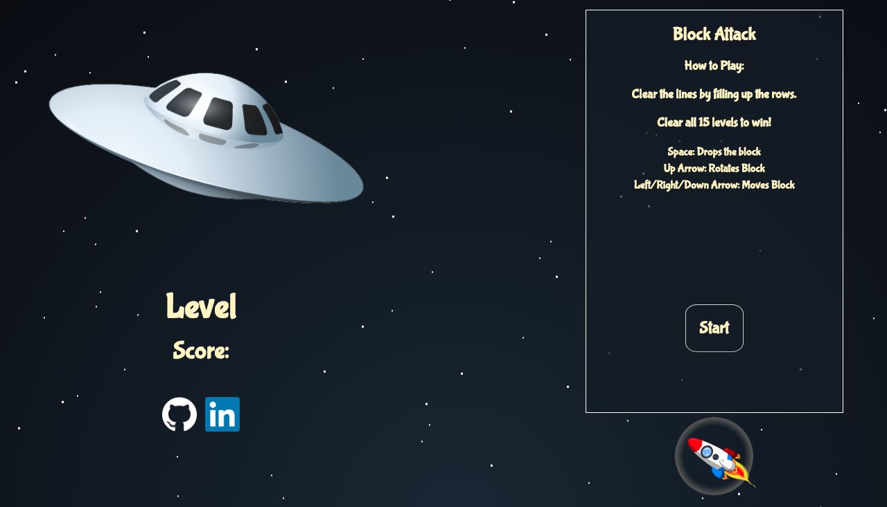
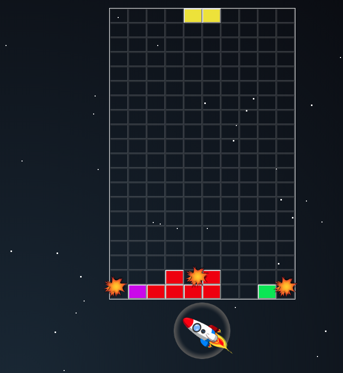
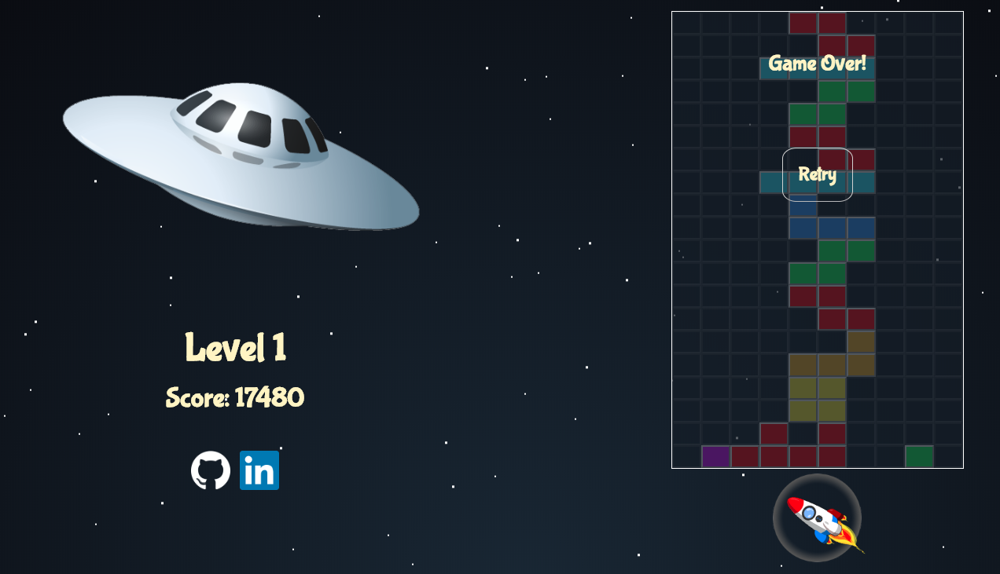

# Block Attack

## Technologies
### Block Attack was created with only Javascript, HTML5, and CSS3

## Background and Overview

Block attack is a rendition of Tetris. Aliens are attacking your spaceship. They are shooting blocks that stick to your force field. Your ship has a blast device but to efficiently deploy its power, it can only be activated when the blocks have evenly attached onto your force field. Your objective is to keep too many blocks from attaching. Otherwise, your force field gets overwhelmed which will lead to your demise.

### Play Block Attack Here: <a href="https://rikeychen.github.io/block-attack/">Block Attack Live</a>



This project was inspired by my life-long enjoyment of tetris. I would freqeuently find myself revisiting the game. In combination with having a fascination of the extra-terrestrial and the interstellar unknown, I decided to build a space-themed Tetris with the power of JavaScript.

## Features

### Movement - Users are able to move the block horizontally and downward.

### Rotation - Users are able to rotate the block clockwise.

The block is first checked to see if it is rotatable at its current position. This check compares the coordinates at the current position to the coordinates at the next rotation. If the next coordinates does not equal to a valid empty space ('X') or is not included in the current position, the block will not be rotated. The algorithm used in finding the new coordinates includes using a pivot of the current position.


```js
  rotatable(block) {
    block.pivot = block.currentPos[0];
    const newCoords = block.currentPos.map((coord) => {
      const [x, y] = coord;
      const newX = y + block.pivot[0] - block.pivot[1];
      const newY = block.pivot[0] + block.pivot[1] - x;
      return [newX, newY];
    });

    for (let i = 0; i < newCoords.length; i++) {
      const [x, y] = newCoords[i];
      if (this.grid[x][y] !== 'X'
        && searchForArray(block.currentPos, newCoords[i]) === -1) {
        return false;
      }
    } return true;
  }

  rotateBlock(block) {
    if (this.rotatable(block)) {
      this.renderBlock('X', block.currentPos);
      block.rotate();
      this.renderBlock(block.symbol, block.currentPos);
    }
  }

```

### Drop - Users are able to force the block downward instantly.

To drop a block into it's predicted position, a helper method `setPresetBlock(block)` was made. The function iterates through a deep duped copy of the main grid and shifts the block downward until unshiftable.


```js
  setPresetBlock(block) {
    const presetBlock = {
      currentPos: block.currentPos.map(coord => Object.assign([], coord)),
    };

    const tempGrid = this.grid.map(a => Object.assign([], a));

    let shiftable = true;
    while (shiftable) {
      const newCoords = this.nextLevel(presetBlock, 'down');
      for (let i = 0; i < newCoords.length; i++) {
        const [x, y] = newCoords[i];
        if (x === 21 || y === 10 || (tempGrid[x][y] !== 'X'
          && searchForArray(presetBlock.currentPos, newCoords[i]) === -1)) {
          shiftable = false;
          break;
        }
      }
      if (shiftable) presetBlock.currentPos = newCoords;
    }
    return presetBlock.currentPos;
  }

```

The final position is then used to `dropBlock(block)` into the new coordinates.

```js
  dropBlock(block) {
    const newCoords = this.setPresetBlock(block);
    this.rowsDropped = newCoords[0][0] - block.currentPos[0][0];
    this.renderBlock('X', block.currentPos);
    block.shift(newCoords);
    this.renderBlock(block.symbol, newCoords);
  }

```

### Clearing - Blocks can be cleared when they fill up an entire row.



### Levels - There are 15 levels.

### Score - Score will increment by clearing and descending blocks.




